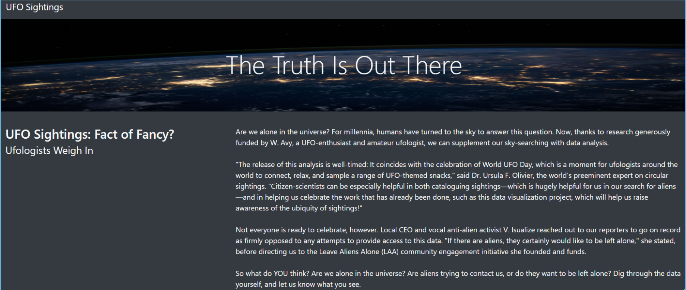
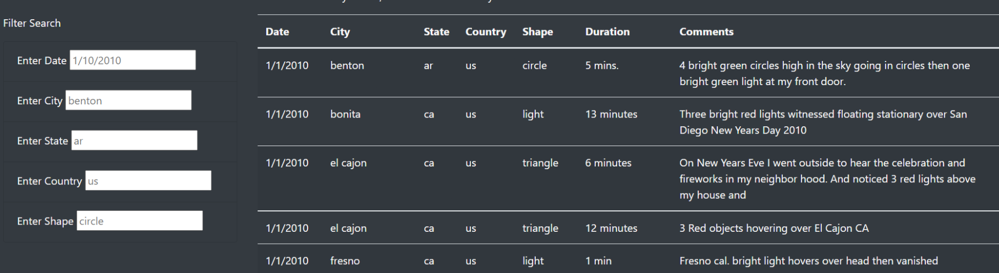
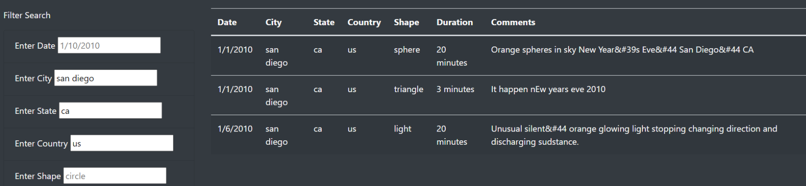

# UFO_Analysis

Overview

The existence of aliens and extra-terrestrials in our world has been argued over the years, especially with reports of UFO sightings in various areas of our planet, and more recently, in the footage released by NASA in 2021. This analysis aims at organizing records of UFO sightings  in various cities in the USA, that could give insight on the presence of aliens in our universe.

Results

I found a  database that contains information about sightings. This database specifies the date, city, state and country of sighting, the shape of the UFO and comments that describe the sightings. The search filter pane is located at the left of the database. It takes in parameters to filter our data by:

- Date of sighting
- City of sighting
- State of sighting
- Country of sighting
- Shape of UFO

The data is filtered by filling out one or more parameters. As more parameters are added, the results are refined. Filling out all parameters will give fewer and more defined results.

The image above shows search results with filter parameters:
- City: San Diego
- State: California
- Country: United States of America

Summary

Drawback

The webpage successfully shows UFO sightings; however, a drawback will be with the way states and countries are represented. Someone else might not know the accurate abbreviations for countries or states in different countries.

Recommendations

1. The states and countries should not be represented by abbreviations.
2. Dropdown lists should be used to filter states and countries instead of text fields.
